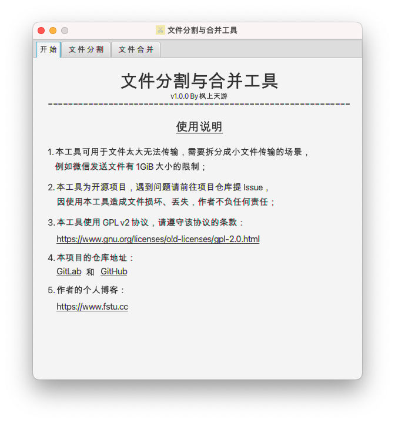
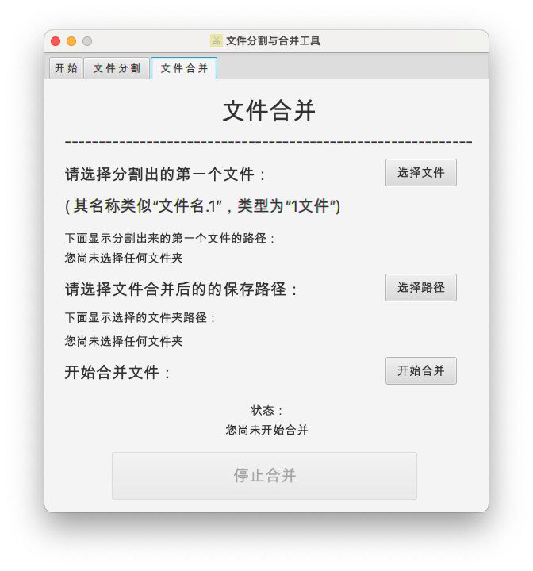

# 文件分割与合并工具

一个小工具，可以分割和合并文件，基于 Java & JavaFX。  

## 使用场景

- 传输文件时有大小限制，无法一次传输一个大文件；  
- 微信传输大于 1GiB 的文件；  
- 一次传输一个大文件的效率太低，将大文件拆开一起发送可以提高效率 ~~（手动多线程）~~；  
- 等等。  

## 项目预览

  
  
  

## 下载地址
[从 GitLab 下载](https://gitlab.com/fstyou/file-split-and-merge-tool/-/releases/permalink/latest)  
[从 GitHub 下载](https://github.com/fstyou/file-split-and-merge-tool/releases/latest)
